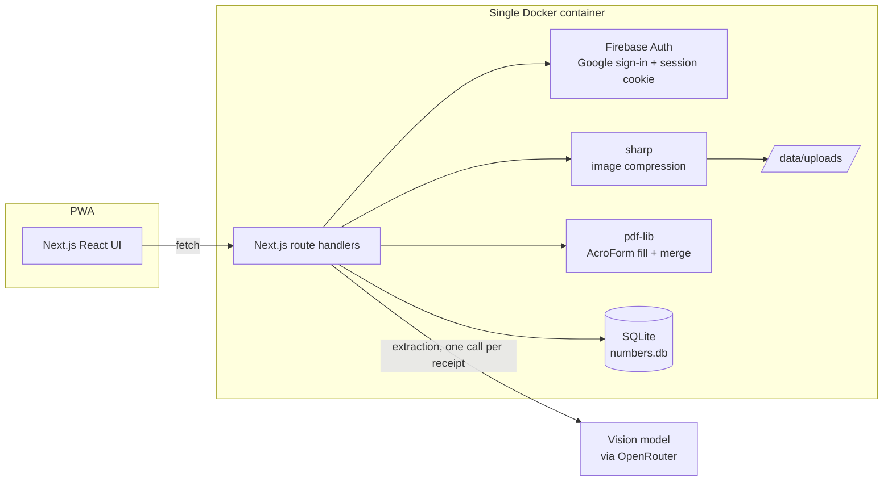
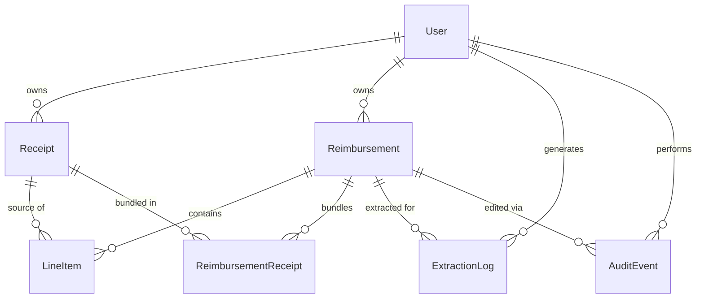

# Numbers — Design Document

*Audience: humans — maintainers, contributors, and the next volunteer who inherits this app.*
*For machine-optimized reference docs, see [`docs/agent/`](./agent/) and the root [`CLAUDE.md`](../CLAUDE.md).*

---

## 1. What this app is

**Numbers** eliminates the friction of submitting expense reimbursements at Chinese For Christ
Church. The core insight is that the painful part of a reimbursement isn't the form — it's that
the form demands all information at once, weeks after the purchase, when the receipt is faded
and half-forgotten in a coat pocket.

Numbers splits the workflow in two:

1. **Capture now.** The moment you buy something, photograph the receipt into your "Shoebox."
   Ten seconds on your phone; no data entry.
2. **File later.** Once a month, select receipts, let an LLM draft the line items, verify each
   row against the receipt image, and print a filled-out copy of the official church form with
   all receipts attached.

The treasurer receives exactly what they've always received — the official
*Invoice Payment / Expense Reimbursement Form* with physical signatures and receipts stapled
behind — so nothing changes for the approval chain. Only the requester's experience changes.

### Design principles

| Principle | Consequence |
| :-- | :-- |
| **Simplicity first** | Capture is friction-free; no OCR, no AI, no form at upload time. |
| **Self-hosted, ultra-lightweight** | One Docker container, SQLite, local file storage. Backup = copy one folder. Runs on a Synology NAS. |
| **Multi-tenant by default** | Google OAuth; every query is scoped to the signed-in user. |
| **Human-in-the-loop** | AI output is *never* trusted. Every row requires an explicit human checkmark before the PDF can exist, and any edit revokes the checkmark. |
| **The paper process is the API** | Output must match the official form exactly; physical signature lines stay blank. |

---

## 2. System overview



One Node.js process serves the UI, the API, and auth. There is no queue, no cache server, no
external database, and no cloud storage. The only external dependency at runtime is the OpenRouter API,
and it is touched only at claim-creation time, once per receipt.

**Why this shape?** The deployment target is church hardware maintained by volunteers. Every
additional moving part is a future 10pm phone call. SQLite handles this workload (tens of users,
hundreds of receipts a year) with five orders of magnitude of headroom, and a single `/data`
folder makes backup a Synology scheduled-copy task.

---

## 3. The user journey and its state machine

The whole app is two entities moving through small state machines, and one join between them.

```
Receipt:        unassigned ──(claim generated for it)──▶ processed
Reimbursement:  draft ──(all rows verified, PDF generated)──▶ generated
```

### Phase 1 — Shoebox (capture)

Upload accepts images and PDFs. Images are compressed server-side to **~100 KB** JPEG
(EXIF-rotation normalized, long edge ≤ 1600 px, quality-ladder 80→40, with a dimension-shrink
fallback); PDFs are stored as-is. Files land in `DATA_DIR/uploads/<userId>/<receiptId>.<ext>`
and a `receipts` row is created with status `unassigned`.

Deliberately, **no AI runs here**. Capture must be instant and free; deferring the LLM work to
claim time means receipts that never make it into a claim never cost an API call.

### Phase 2 — Batch & generate

The user selects receipts and hits *Generate Claim*. The server sends **one OpenRouter request
per receipt** (a few in flight at a time; images as base64 `image_url` parts, PDFs as file
parts). Small vision models attribute items unreliably when several documents share a context,
so each call sees exactly one document and the server stamps the receipt id on every extracted
item — the model never outputs ids. If any receipt fails, no claim is created (but every call is
still logged). The prompt (see `src/lib/ai/prompt.ts`) demands:

- line items extracted verbatim,
- taxes and fees as their own dedicated rows,
- returns/refunds as **negative** quantities and amounts,
- raw JSON array output.

The model is never asked to pick a ministry — there is nothing on a receipt it could reasonably
infer that from, so assigning one is an explicit human step during review. The response is
parsed defensively (markdown fences stripped, prose tolerated), validated with zod, and each
item is stamped with its receipt id server-side (ids in model output are ignored). On success a
`draft` reimbursement is created with one unverified, ministry-less line item per extracted
row.

### Phase 3 — Review & validate (the heart of the app)

A side-by-side screen: original receipts on the left, an editable grid on the right, **grouped
by source receipt**, each group showing a live subtotal to eyeball against the printed receipt
total.

Row operations and their exact semantics:

| Operation | Semantics |
| :-- | :-- |
| **Approve** (checkmark) | Sets `isVerified`. Refused (server-side) until the row has a ministry — choosing one is part of the human sign-off. The PDF button is enabled only when *every non-excluded row* is verified. |
| **Edit** (description, qty, amount, ministry) | Persists immediately and **revokes `isVerified`** — a changed row must be re-checked by a human. Enforced server-side. |
| **Exclude** (trash) | Strikes the row out and removes it from all totals. Excluded rows don't need verification and don't reach the PDF. Reversible (Restore). |
| **Split** | Divides one row's amount into two rows (default even split, odd cent stays on the first). Both halves come back **unverified**. The second half is marked human-created in telemetry. |
| **Adjust tax** | Not a special feature — because tax is its own row, excluding a personal item just means editing the tax row's amount. This is why the prompt demands dedicated tax rows. |

Refund rows (negative amounts) render red with a REFUND badge so a `-$27.98` line is impossible
to misread.

**The validation rule is the product.** The disabled *Generate PDF* button is the UI expression;
the API enforces the same rule independently (`400` with a count of unverified rows), so no
client bug can produce an unreviewed form.

### Phase 4 — PDF generation

The official church form (`assets/cfcc-form-template.pdf`) turned out to be a **fillable
AcroForm**, which made the "overlay text at coordinates" plan obsolete: we fill the form's named
fields and **flatten** each page, so alignment with the printed form is exact by construction.

- The form's table holds **13 rows**. Claims with more items paginate onto additional filled
  copies of the form: earlier pages show `(continued)` in the Total cell and a page marker; the
  grand total appears only on the final form page.
- Every receipt is appended after the form pages — images scaled onto US Letter pages with an
  index label, PDF receipts merged page-by-page.
- "Make check payable to" / "Mail check to address" come from the user's profile; `Requestor
  Name` and `Request Date` are stamped; **signature lines and the treasurer box stay blank** —
  those belong to ink.

Generating the PDF transitions the claim to `generated` (frozen — line items can no longer be
edited) and its receipts to `processed`. The PDF can be re-downloaded at any time; it is
regenerated deterministically from the stored data.

### Phase 5 — Physical signatures

Outside the system on purpose. The user prints, signs "Requested by," obtains the pastor/deacon
signature, and drops the packet in the treasurer's inbox. Changing the church's approval
workflow was explicitly out of scope; matching it exactly was the requirement.

---

## 4. Data model



Notable decisions:

- **Money is integer cents everywhere** (`amountCents`, `totalCents`). Dollars exist only at
  the UI/LLM boundary, converted through `src/lib/money.ts`. No floats touch arithmetic.
- **`totalCents` is denormalized** on the reimbursement and recomputed server-side after every
  line-item mutation — the client never computes an authoritative total.
- **Negative is a first-class value.** Refunds are just negative quantities/amounts; subtotals,
  grand totals, and the PDF all handle them with no special cases beyond red styling.
- **The join table** (`reimbursement_receipts`) exists because a claim bundles several receipts
  and, until generation, a receipt could in principle appear in more than one draft.

### Telemetry for prompt tuning (added later, worth understanding)

Three layers record "what the AI said" vs. "what the human accepted":

1. **`extraction_logs`** — one row per extraction call, *including failures*: the model id, the exact
   prompt, receipt metadata (never image bytes), the raw response, parsed items, error message,
   and duration. Survives claim deletion (`reimbursementId` nulls out).
2. **`line_items.original*`** — the AI-extracted description/quantity/amount frozen at
   claim creation. Original-vs-final diffs are computable at any time without replaying events.
   `NULL` originals mark human-created rows (the second half of a split).
3. **`audit_events`** — the chronological trail: every edit with field-level `{from, to}`
   diffs, plus split events.

`GET /api/extraction-logs/:id` assembles the full tuning record (prompt, raw response, final
rows with per-field `corrections`, audit trail). The intended workflow: periodically export
success logs where `corrections` is non-empty, look for systematic model errors (wrong tax
handling, missed refunds), and tighten the prompt.

---

## 5. Security model

- **Authentication**: Google sign-in via Firebase Authentication in the browser. The server
  verifies the Firebase ID token once at login (`firebase-admin`, signature check against
  Google's public certs — no service-account key), upserts a domain `User` row by verified
  email, and issues its own HMAC-signed session cookie (no session table). A passwordless
  *Dev Login* endpoint exists **only** when `AUTH_TEST_MODE=1` — never set it in production.
- **Authorization**: there are no shared resources, so authorization is uniformly "owner only."
  Every query filters by the session's `userId`; cross-tenant access attempts return `404` (not
  `403`) so resource existence isn't leaked. This is covered by a dedicated e2e test.
- **File serving**: receipt files are served through an auth-checked route handler, never from
  a public directory. Path traversal is blocked by resolving against `DATA_DIR` and refusing
  escapes.
- **Server-side enforcement**: the verify-before-PDF gate, the edit-revokes-verification rule,
  and the frozen-after-generation rule are all enforced in route handlers. The UI mirrors them
  for UX, but the API is the authority.

---

## 6. Testing strategy

Three layers, each catching what the layer below can't:

1. **Unit (Vitest, 47 tests)** — pure logic: money parsing/formatting round-trips, 13-row
   pagination, LLM response parsing (fences, prose, refunds, hallucinated ids, garbage), image
   compression against a deliberately noisy synthetic photo, audit diffs, and PDF generation.
   The PDF tests decompress the output's content streams and decode pdf-lib's hex-encoded
   strings to assert that names, dates, and totals are *actually drawn*, not just that pages
   exist.
2. **E2E (Playwright, 7 scenarios × browser matrix)** — a production build served against an
   isolated database with mocked AI (`AI_MOCK=1`) and dev login. The flagship test walks the
   entire journey with exact dollar assertions after every operation (exclude → $56.04,
   tax-adjust → $54.65, split conserves totals…) and validates the downloaded PDF's page count
   and the telemetry records. Additional scenarios cover pagination, multi-tenant isolation,
   the API-level verification gate, housekeeping, and the mobile capture flow. The matrix is
   **(desktop, mobile) × (chromium, webkit)**; test users are namespaced per project so engines
   share one server.
3. **Visual verification** — the e2e run screenshots every screen, and `scripts/render-pdf.mjs`
   rasterizes generated packets so a human (or agent) can eyeball the filled form against the
   real template.

The deterministic AI mock is what makes the e2e suite possible: it returns a fixed Costco-style
basket (with a refund variant triggered by "refund" in the filename), so every downstream number
is predictable to the cent.

---

## 7. Operations

- **Deploy**: one container (`Dockerfile`, `docker-compose.yml`). On boot the entrypoint
  creates `/data/uploads`, runs `prisma migrate deploy`, then starts the standalone Next.js
  server. Reverse-proxy with HTTPS and add the public domain to Firebase's authorized domains.
- **Backup**: copy `/data`. It contains the SQLite db and every receipt file. Restore = put it
  back.
- **CI/CD**: `ci.yml` runs unit + the e2e matrix on every PR and merge; `docker.yml` dry-builds
  the image on PRs and pushes `latest` + `sha-*` tags to Docker Hub on merge
  (secrets: `DOCKERHUB_USERNAME`, `DOCKERHUB_TOKEN`).
- **Swapping the form**: if the church revises its PDF, drop the new file in as
  `assets/cfcc-form-template.pdf` (or point `TEMPLATE_PDF` at it). As long as the AcroForm
  field names are unchanged, nothing else moves. If field names change, update
  `src/lib/pdf/generate.ts` and the field-name table in `docs/agent/ARCHITECTURE.md`.

---

## 8. Decision log

| # | Decision | Alternatives considered | Why |
| :-- | :-- | :-- | :-- |
| 1 | SQLite + local files | Postgres, S3-style storage | Zero-maintenance target hardware; workload is tiny; backup story is "copy a folder." |
| 2 | Firebase Auth for identity + our own stateless signed cookie | NextAuth (previous), Firebase session cookies via service account | Firebase owns the OAuth dance and console; verifying the ID token needs only the project id, so the container ships with zero Google secrets. The HMAC cookie keeps the schema domain-only, needs no session GC, and sign-out needs no server state. |
| 3 | Integer cents | Float dollars, decimal library | Floats drift; a decimal dep is overkill for add/subtract. Cents make every total exact. |
| 4 | One LLM call per receipt, at claim time | One batched call per claim | Batching confused small vision models — items got attributed to the wrong receipt. Per-receipt calls make attribution exact by construction (the server stamps the id), and at ~$0.001/receipt the extra cost is noise. Extraction still waits for claim time so unclaimed receipts cost nothing. |
| 5 | AcroForm fill + flatten | Coordinate overlay on a scanned form | The real form ships with named fields; filling them is exact by construction and survives font/spacing quirks. (The overlay engine existed first and was deleted — the form's field names are the contract now.) |
| 6 | Verification gate enforced in API | UI-only disabled button | The rule is the product's integrity guarantee; it must hold against client bugs. |
| 7 | Edit revokes verification | Trust prior checkmark | A checkmark attests to specific values; changed values are unattested by definition. |
| 8 | AI mock + dev login baked in (env-gated) | Test-only stubs outside the app | The whole journey becomes testable offline and in CI with zero secrets; the mock doubles as an offline dev mode. |
| 9 | Telemetry as snapshot + event log | Event log only | `original*` columns answer "what did the human fix" with a single query; events add the *how/when*. Failed calls are logged too — bad model output is tuning gold. |
| 10 | 13 rows per form page | Blueprint said ~8 | The real form has a 13-row table; the form wins over the spec. |

---

## 9. Known limits & future work

- **No treasurer/admin role yet.** `users.role` exists but nothing reads it. A treasurer
  dashboard (see all generated claims, mark paid, export tuning data across tenants) is the
  natural next feature.
- **Receipts are immutable.** No rotate/crop/re-upload; users delete and re-shoot instead.
- **Prompt tuning is manual.** The telemetry gives you the dataset; there's no automated eval
  loop. A `scripts/` harness that replays logged receipts against a candidate prompt and scores
  it against the human-corrected values would close the loop.
- **English-only UI.** A Chinese localization would serve this congregation well.
- **PDF ingestion** uses OpenRouter's `file` content part; if that shape changes,
  only `src/lib/ai/extract.ts` is affected.
